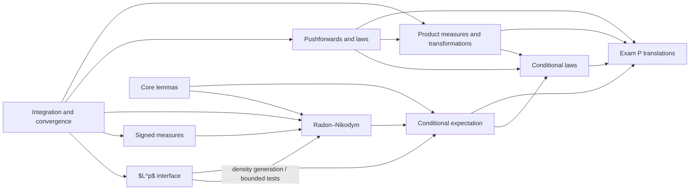

# Dependency Map

## Main architecture

Product Measures and Transformations is now a formal in-progress module. Its Cours and first TD/corrigé establish the product-integration interface; Colles and full Example Sheets remain deferred, so the module is not yet marked deployable.

## Function-space gate

The $L^p$ interface supplies admissible inputs to later probability constructions:

$$
Y\in L^1(\mathbb P)
\Longrightarrow
Y\mathbb P\text{ is a finite signed measure},
$$

$$
Y\in L^1(\mathbb P),\ Z\in L^\infty(\mathbb P)
\Longrightarrow
YZ\in L^1(\mathbb P),
$$

and

$$
U,V\in L^2(\mathbb P)
\Longrightarrow
UV\in L^1(\mathbb P).
$$

On a probability space,

$$
L^\infty(\mathbb P)
\subseteq
L^2(\mathbb P)
\subseteq
L^1(\mathbb P).
$$

These statements respectively control finite RN numerators, bounded test identities, and second-moment cross terms. The arrow from the $L^p$ interface to Radon–Nikodym is therefore an interface dependency, not a proof implication: an $L^p$ embedding does not produce Hahn local domination. Radon–Nikodym additionally requires a numerator measure, a reference measure, absolute continuity and the theorem's measure-theoretic regime.

## Canonical Radon–Nikodym proof route

The project uses the Hahn-first route:

$$
\text{Hahn decomposition}
\longrightarrow
\text{local density fragment}
\longrightarrow
\text{maximal representable submeasure}
\longrightarrow
\text{residue elimination}
\longrightarrow
\sigma\text{-finite gluing}.
$$

Le Gall's $L^2$ proof is a comparison route, not a hidden prerequisite of the canonical proof.

## Conditional representation

Let $(\Omega,\mathcal F,\mathbb P)$ be a probability space, let $\mathcal G\subseteq\mathcal F$ be a sub-$\sigma$-field, and let $Y\in L^1(\mathbb P)$. Then

$$
Y
\longmapsto
\nu_Y(A)=\mathbb E[Y\mathbf1_A]
\longmapsto
\frac{d\nu_Y}{d(\mathbb P|_{\mathcal G})}
\longmapsto
\mathbb E[Y\mid\mathcal G].
$$

For a measurable map $X:(\Omega,\mathcal F)\to(S,\mathcal S)$, set $\mu_X=X_\#\mathbb P$. Conditioning on $\sigma(X)$ admits the state-space form

$$
Y
\longmapsto
\rho_Y=X_\#(Y\mathbb P)
\longmapsto
g_Y=\frac{d\rho_Y}{d\mu_X}
\longmapsto
g_Y(X).
$$

## Boundary

The construction of $g_D$ separately for each event $D$ does not by itself produce a jointly measurable probability kernel. Under a dominated Euclidean joint law, the Conditional Laws module constructs an explicit kernel from one jointly measurable conditional density. Only general regular-conditional-law existence and disintegration remain outside the present module and require additional hypotheses.
