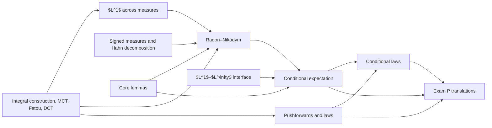

# Dependency Map

## Main architecture

The next formal module is product measures, Tonelli/Fubini and change of variables. It will sit between integration theory and the joint-law applications of pushforwards.

## Canonical Radon–Nikodym proof route

The project uses the Hahn-first route:

$$
\text{Hahn decomposition}
\longrightarrow
\text{local density fragment}
\longrightarrow
\text{maximal representable submeasure}
\longrightarrow
\text{residue elimination}
\longrightarrow
\sigma\text{-finite gluing}.
$$

Le Gall's $L^2$ proof is a comparison route, not a hidden prerequisite of the canonical proof.

## Conditional representation

$$
Y
\longmapsto
\nu_Y(A)=\mathbb E[Y\mathbf1_A]
\longmapsto
\frac{d\nu_Y}{d(\mathbb P|_{\mathcal G})}
\longmapsto
\mathbb E[Y\mid\mathcal G].
$$

For conditioning on $X$:

$$
Y
\longmapsto
\rho_Y=X_\#(Y\mathbb P)
\longmapsto
g_Y=\frac{d\rho_Y}{d\mu_X}
\longmapsto
g_Y(X).
$$

## Boundary

The construction of $g_D$ for each event $D$ does not by itself produce a jointly measurable probability kernel. Regular conditional laws and disintegration require an additional module and additional hypotheses.
